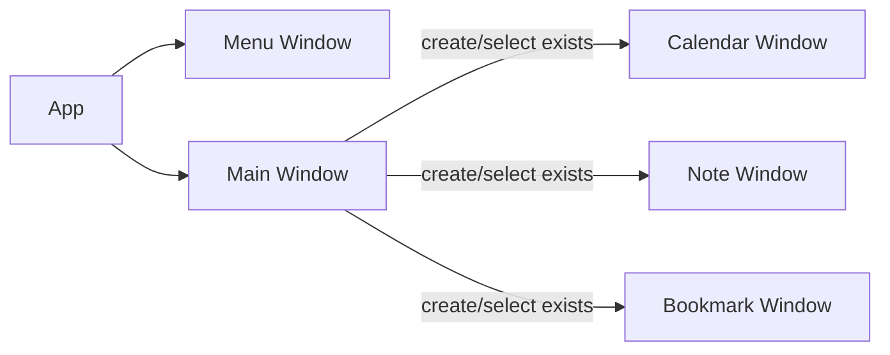

## Build
- 正式 app
    2. `cmake -S ./apps/myapp/ -B ./build && make -C build -j $(nproc)`
        - make 时可以先用 `make -C build -j 4` 防止占用内存过大
    3. (root) `./build/bin/myapp`
- 测试 app
    1. `mkdir -p build/ && cd build`
    2. `cmake -S ./apps/test_app/ -B ./build && make -C build -j $(nproc)`
    3. (root) `./build/bin/myapp`

## TODOs

- 界面设计
    - 页面列表(menu); 新增页面/搜索等
    - 主页面(当前选中页面展示)
- 日历单元格事件
    - 事件包含具体时间
- 书签页
    - 用于整理收藏内容, 包含 `tag`/`url`/`描述`

