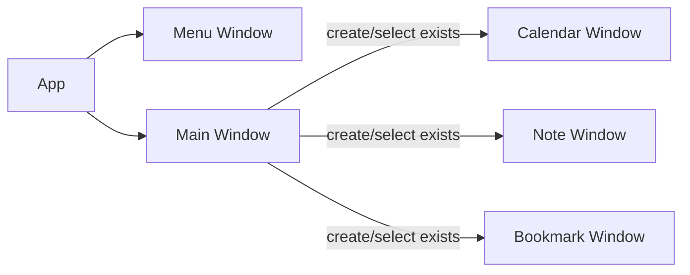

## TODOs

- 界面设计
    - 页面列表(menu); 新增页面/搜索等
    - 主页面(当前选中页面展示)
- 日历单元格事件
    - 事件包含具体时间
- 书签页
    - 用于整理收藏内容, 包含 `tag`/`url`/`描述`

```mermaid
graph LR

a[App]
m[Menu Window]
mw[Main Window]

a --> m
a --> mw

cw[Calendar Window]
nw[Note Window]
bmw[Bookmark Window]

mw -->|create/select exists| cw
mw -->|create/select exists| nw
mw -->|create/select exists| bmw

```
